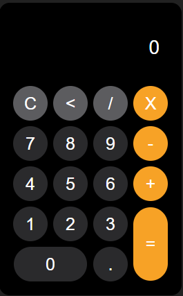

# Calculadora 2.0

Este é um projeto de uma **calculadora simples** desenvolvida utilizando **HTML**, **CSS** e **JavaScript**. A calculadora permite realizar operações matemáticas básicas, como soma, subtração, multiplicação e divisão.

## Funcionalidades

- **Operações Básicas**: Soma, subtração, multiplicação e divisão.
- **Limpar**: A funcionalidade de limpar a tela (botão `C`).
- **Apagar**: A funcionalidade de apagar o último caractere (botão `<`).
- **Resultado**: Exibe o resultado da operação ao pressionar o botão de igual (`=`).
- **Interface Intuitiva**: Design responsivo e simples, com botões grandes e fáceis de interagir.

## Tecnologias Utilizadas

- **HTML**: Estrutura e layout da página.
- **CSS**: Estilização da interface, incluindo a disposição dos botões e o design geral.
- **JavaScript**: Lógica de cálculo e manipulação de eventos nos botões.

## Como Usar

1. **Abrir o arquivo**: Basta abrir o arquivo `index.html` em seu navegador para utilizar a calculadora.
2. **Clique nos botões**: Use os botões numéricos e operacionais para construir uma operação matemática.
3. **Pressione `=`**: Após inserir uma operação, clique no botão `=` para calcular o resultado.
4. **Limpar/Apagar**: Se desejar limpar o visor, clique em `C`. Para apagar o último caractere, clique em `<`.

## Exemplos de Operações

- `5 + 3 = 8`
- `9 * 2 = 18`
- `8 - 4 = 4`
- `10 / 2 = 5`

## Imagem da Interface

## Estrutura do Projeto

